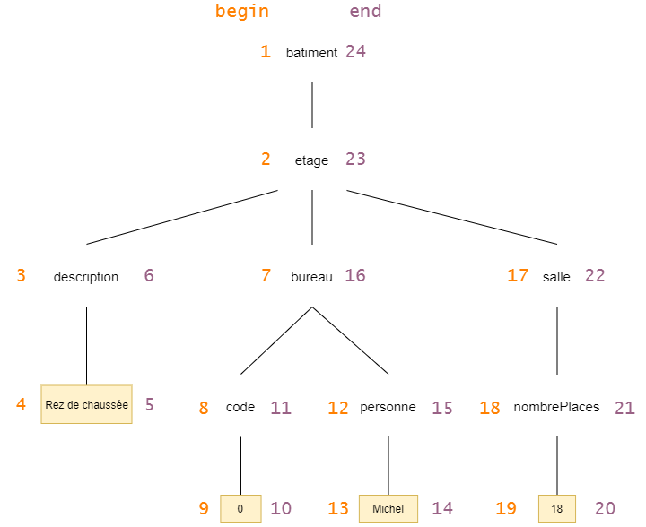

# Question 1 :
## 1.2
### (i)
/batiment//salle
SELECT node, txtval, numval FROM batiment_etage_salle;

### (ii)
/batiment/etage/salle/text()
SELECT txtval, numval FROM batiment_etage_salle 

### (iii)
/batiment/etage/salle[nbplace > 10]
SELECT node, numval FROM batiment_etage_salle_nbplace WHERE numval > 10

## 1.3
On peut numéroté avec des begin et end. Ou même avec Pre et Post

# Question 2 :
<!DOCTYPE presse [
    <!ELEMENT presse (journal,journalistes)>
    <!ELEMENT journal (nom, directeur, article*)>
    <!ELEMENT article (corps)>
    <!ATTLIST article titre CDATA #IMPLIED>
    <!ATTLIST article auteur IDREF #REQUIRED>
    <!ELEMENT corps (#PCDATA)>
    <!ELEMENT journalistes (journaliste+)>
    <!ATTLIST journaliste idJ ID #REQUIRED>
    <!ELEMENT journaliste ((nom,prenom)|pseudonyme)>
    <!ATTLIST journaliste anonymisation (oui|non) “non”>
    <!ELEMENT pseudonyme (#PCDATA)>
    <!ELEMENT nom (#PCDATA)> 
    <!ELEMENT prenom (#PCDATA)>
    <!ELEMENT directeur (nom,prenom)> 
]>

## 2.1
presse(presseID)
journal(presseID, journalID, nom : string)
directeur(journalID, directeurID, nom : string, prenom : string)
article(journalID, articleID, auteurIDREF, titre : string, corps : string)
journalistes(presseID, journalistesID)
journaliste(journalistesID, journalisteID, pseudo : string, nom : string, prenom : string, anonymisation : string)

## 2.2
INSERT INTO presse (presseID) VALUES (1)
INSERT INTO journal (presseID, journalID, nom) VALUES (1, 1, 2)
INSERT INTO directeur (journalID, directeurID, nom, prenom) VALUES (1, 1, 2, "Jean", "Michel")
INSERT INTO article (journalID, articleID, auteurIDREF, titre, auteur, corps) VALUES (1, 1, 1, "NEVER GONNA GIVE YOU UP", "Biographie de Rick Astley")
INSERT INTO journalistes(presseID, journalistesID) VALUES (1, 1)
INSERT INTO journaliste(journalistesID, journalisteID, pseudo, nom, prenom, anonymisation) VALUES (1, 1, "jaimelathune", "Balkany", "Patrick", "cpasmoi")
INSERT INTO journaliste(journalistesID, journalisteID, pseudo, nom, prenom, anonymisation) VALUES (1, 2, "Xari", "leFAST", "Xavier", "Formule1")

## 2.3
### (i)
/presse/journal/directeur[prenom = "Michel]
SELECT * FROM directeur WHERE prenom="Michel";

### (ii)
/presse//article[@auteurIDREF = "1"]
SELECT * FROM article WHERE auteurIDREF = 1;

### (iii)
/presse//journaliste[anonymisation = "Formule1"]
SELECT pseudo, nom, prenom FROM journaliste WHERE anonymisation = "Formule1"

# Question 3
1.

voir [begin_end.sql](./sql/begin_end.sql)

3.
SELECT * FROM NODE WHERE parent = 29;
SELECT * FROM NODE WHERE nodType = 'txt';
SELECT * FROM NODE WHERE tag = 'pseudo';

4.
Avec affichage cela prend 9034 millisecondes.
Sans affichage cela prend 842 millisecondes.

5.
voir [insert_prepost.sql](./sql/insert_prepost.sql)