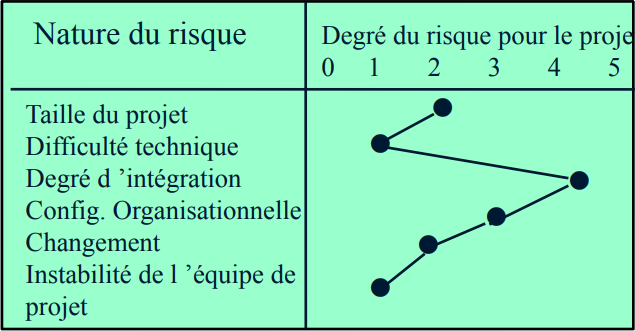
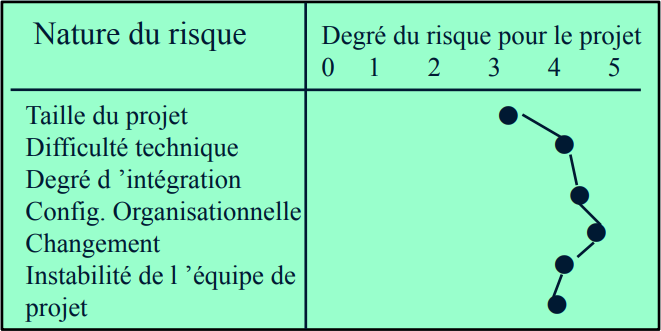
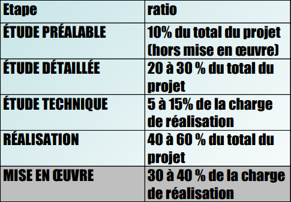

# HMIN204 - Conduite de projet

"Il faut toujours plus de temps que prévu, même en tenant compte du théorème d’Eric Bourreau, Eric Bourreau 2021"

* [Liens utiles](#liens-utiles)
* [Découpage d'un projet](#découpage-dun-projet)
	* [Découpage temporel standard](#découpage-temporel-standard)
* [Modèle de développement: les cycles de vie](#modèle-de-développement-les-cycles-de-vie)
* [Analyse du risque](#analyse-du-risque)
	* [Facteurs](#facteurs)
	* [Profil de risque](#profil-de-risque)
* [Méthode de répartition proportionnelle](#méthode-de-répartition-proportionnelle)
* [Technique de planification](#technique-de-planification)
* [Organisation du travail](#organisation-du-travail)

## Liens utiles

[Accès au moodle](https://moodle.umontpellier.fr/course/view.php?id=6139)

## Découpage d'un projet

### Découpage temporel standard

#### 🚩 **1. Etude préalable**

Réaménager une application ou répondre à un besoin nouveau. Découpé en trois phases :

	1. Observation (~30-40%)
	2. Conception/Organisation (~50-60%)
	3. Appréciation (bilan & choix) (~10%)

#### 🚩 **2. Etude technique**

Optimiser les structures de données et les algorithmes de traitement.

#### 🚩 **3. Etude détaillée**

Préparation des contrats de réalisations (contenant les cahiers des charges).

#### 🚩 **4. Réalisation**

Produire un logiciel testé.

#### 🚩 **5. Mise en œuvre**

Installation et intégration des logiciels testé.

## Modèle de développement: les cycles de vie

[voir diapo 13 - 15](cours/Conduite%20de%20Projet%20HMIN204%20Cours.pdf)

## Analyse du risque

### Facteurs

🚸 Taille du projet  
🚸 Difficulté technique  
🚸 Degré d'intégration  
🚸 Configuration organisationnelle  
🚸 Changement  
🚸 Instabilité de l'équipe de projet

### Profil de risque

:pencil2: Cas d'un risque normal

:pencil2: Cas d'un risque extrême

## Méthode de répartition proportionnelle

:warning: Ces ratios sont issus d'expérience (ce sont des recommandations) :warning:

## Technique de planification

[voir diapo 27-40](cours/Conduite%20de%20Projet%20HMIN204%20Cours.pdf)

## Organisation du travail

| Nom                      | Description                                                           |
| ------------------------ | --------------------------------------------------------------------- |
| Maître d'œuvre           | Founis la prestation et responsable de la conduite du projet          |
| Maître d'ouvrage         | Représente le client                                                  |
| Chef de projet           | Responsable devant le maître d'œuvre                                  |
| Concepteur               | Informaticien, organisateur ou gestionnaire                           |
| Développeur              | Informaticien                                                         |
| Utilisateur final        | Exprime des besoins et des contraintes liée au travail courant        |
| Utilisateur gestionnaire | Exprime des besoins favorisant la gestion à moyen terme de l'activité |
| Utilisateur décideur     | Peut modifier les règles du système de gestion                        |