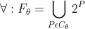

# HMIN233 - FIM - TD2

:mortar_board: Canta Thomas

:email: thomas.canta@etu.umontpellier.fr

## Exercice 1

### Question 1

M1 = { Ti ∈ D | ∀Tj ∈ D : (i ≠ j) ^ (Ti ⊄ Tj) }

### Question 2

On peut avoir ∀θ : Fθ = Mθ = Cθ avec un dataset comme :

:pushpin: L'ensemble d'item I = {A, B, C, D, E, F}

:pushpin: L'ensemble des transactions T suivantes:

	T1 = A
	T2 = B
	T3 = C
	T4 = D

Alors :

:round_pushpin: Fréquent: F1 = {A, B, C, D}

:round_pushpin: Maximum: M1 = {T1, T2, T3, T4}

:round_pushpin: Clos: C1 = {T1, T2, T3, T4}

:bulb: Conclusion :

## Exercice 2

### Question 1

:pushpin: M&theta; = {ABC3, DE2, EF5}

:round_pushpin: Fréquent : F = {A, B, C, D, E, F, AB, AC, BC, DE, EF, ABC}

### Question 2

:round_pushpin: Clos : C = {ABC3, ABE5, DE2, EF5}

:round_pushpin: Fréquent : F = { 
A5, 
B5, 
C3,
D2, 
E5, 
F5, 
AB5, 
AC3, 
BC3, 
DE2, 
EF5, 
ABC3,
ABE5
}

### Question 3

:round_pushpin: Maximum :
M3 = {BCE4, AC3}

:round_pushpin: Clos :
C3 = {BE5, C5, BCE4, AC3}

:round_pushpin: Fréquent :
F3 = {A3, C5, AC3, B5, E5, BC4, BE5, CE4, BCE4
}

